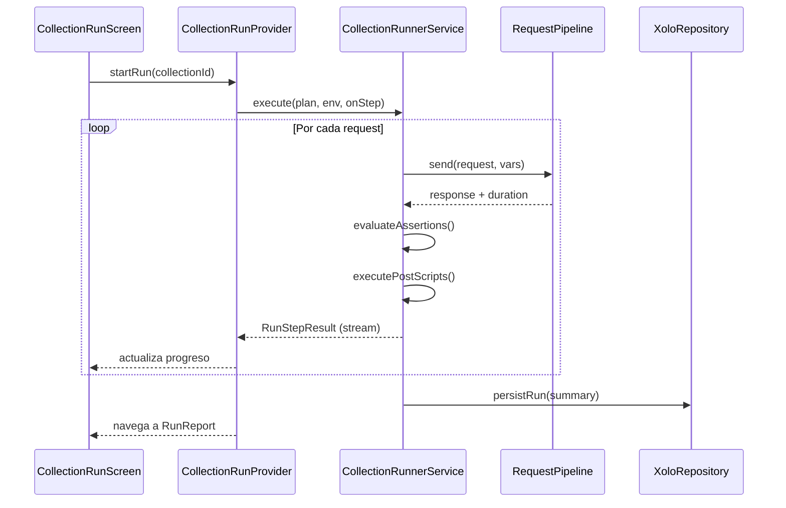
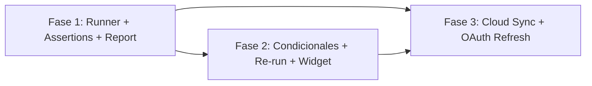

# Roadmap de Automatización Móvil — Xolo API Hub

> **Posicionamiento:** cliente API móvil orientado a **automatización de flujos** (collection runner, assertions, encadenamiento). **Solo mobile** (Android primero; iOS cuando aplique). Sin planes desktop/web.

> **Estado base (2026-06):** pre/post scripts declarativos, JSONPath chaining manual, colecciones jerárquicas, entornos, auth heredada, OAuth2, backup local cifrado. **No existe** runner, assertions ni historial de runs.

---

## Principios de diseño

| Principio | Decisión |
|-----------|----------|
| Motor de scripts | **DSL declarativo JSON** (extender el modelo actual), no runtime JS |
| Ejecución | **Foreground** con UI de progreso; cancelable; sin polling en background |
| Arquitectura | Modular monolith: lógica en `domain/` + `core/`, persistencia en `data/`, UI en `presentation/` |
| Estado en UI | Riverpod con **streams/eventos** para progreso del runner (no polling) |
| Calidad | Cada entrega mantiene `flutter analyze` limpio y cobertura ≥ 100% en código nuevo |
| i18n | Todas las cadenas visibles en `app_en.arb` / `app_es.arb` |

---

## Arquitectura objetivo

```
presentation/
  screens/collection_run_screen.dart      # Progreso en vivo
  screens/run_report_screen.dart          # Detalle post-ejecución
  providers/collection_run_provider.dart  # Orquestación UI
  widgets/run/run_progress_list.dart

domain/
  entities/
    assertion_rule_entity.dart
    collection_run_entity.dart
    run_step_result_entity.dart
  repositories/xolo_repository.dart       # + métodos de runs
  services/
    collection_runner_service.dart        # Orquestador puro (testeable)
    assertion_evaluator.dart
    run_plan_builder.dart                 # Aplana colección → lista ordenada

core/
  utils/variable_parser.dart              # + helpers dinámicos (Fase 2)
  utils/script_executor.dart              # Sin cambios mayores Fase 1

data/
  local/tables.dart                       # + CollectionRuns, RunStepResults
  local/run_queries.dart
  repositories/drift_xolo_repository.dart
```

### Flujo de ejecución (Fase 1)



---

## Fase 1 — Motor de ejecución

**Objetivo:** ejecutar una colección/carpeta en secuencia, validar con assertions y mostrar un reporte.  
**Duración estimada:** 3–4 sprints (2 semanas c/u).  
**Hito de producto:** un usuario importa 10 requests encadenados, pulsa **Run**, ve **8/10 passed** con detalle del fallo.

### 1.1 Modelo de dominio

| Entrega | Descripción |
|---------|-------------|
| `AssertionRuleEntity` | Regla declarativa: `type`, `target`, `expected`, `operator` |
| `RunStepResultEntity` | Resultado por request: status, duration, assertions, extracted vars, error |
| `CollectionRunEntity` | Run completo: id, collectionId, envId, startedAt, finishedAt, summary |
| `RunPlanItem` | Request aplanado con orden, auth resuelta, scripts, assertions |

**Tipos de assertion (MVP Fase 1):**

| `type` | Ejemplo |
|--------|---------|
| `status_code` | `equals 200`, `in [200, 201]` |
| `response_time_ms` | `lessThan 3000` |
| `json_path_exists` | `$.token` exists |
| `json_path_equals` | `$.status` equals `"ok"` |
| `body_contains` | body contains `"success"` |

Persistencia: columna nueva `assertionsJson` en `SavedRequests` (nullable; vacío = sin tests).

### 1.2 Persistencia (Drift migration vN)

**Tabla `CollectionRuns`**

| Columna | Tipo | Notas |
|---------|------|-------|
| id | PK | |
| collectionId | FK → Collections | Colección/carpeta ejecutada |
| workspaceId | FK nullable | Contexto activo |
| environmentId | FK nullable | Entorno usado |
| status | text | `running`, `completed`, `cancelled`, `failed` |
| totalSteps | int | |
| passedSteps | int | |
| failedSteps | int | |
| skippedSteps | int | |
| startedAt / finishedAt | datetime | |
| stopOnFailure | bool | default true |

**Tabla `RunStepResults`**

| Columna | Tipo | Notas |
|---------|------|-------|
| id | PK | |
| runId | FK → CollectionRuns | |
| savedRequestId | FK nullable | |
| stepIndex | int | Orden en el plan |
| name, method, url | text | Snapshot |
| statusCode, durationMs | int nullable | |
| passed | bool | |
| assertionResultsJson | text | Detalle por assertion |
| errorMessage | text nullable | |
| responseBodySnippet | text nullable | Primeros N chars para reporte |

**Extensión `SavedRequests`:** `assertionsJson TEXT nullable`

### 1.3 Servicios de dominio

#### `RunPlanBuilder`

- Input: `collectionId`, `XoloRepository`
- Output: `List<RunPlanItem>` ordenado (depth-first: carpetas → requests)
- Reutiliza lógica de árbol ya presente en `SyncService` / `collection_queries.dart`

#### `CollectionRunnerService`

Responsabilidades (clase pura, inyectable):

1. Construir variables base (entorno + workspace)
2. Por cada `RunPlanItem`:
   - `ScriptExecutor.executePreScripts`
   - Resolver auth vía `AuthResolverService`
   - Enviar HTTP (extraer pipeline común desde `RequestController`)
3. `AssertionEvaluator.evaluate(response, rules)`
4. Post-scripts → `upsertVariable` (reutilizar lógica de `_executeScripts`)
5. Emitir `RunStepResult` vía callback/stream
6. Si `stopOnFailure` y fallo → abortar resto
7. Respetar `CancelToken`

**Refactor previo obligatorio:** extraer `RequestPipeline` desde `request_provider.dart` para que runner y composer compartan el mismo camino de envío (evitar duplicación).

#### `AssertionEvaluator`

- Funciones puras, 100% unit-testeables
- Retorna `List<AssertionResult>` con `passed`, `message`, `rule`

### 1.4 Capa de presentación

| Pantalla / widget | Responsabilidad |
|-------------------|-----------------|
| Botón **Run** en `ActiveWorkspaceExplorer` | Abre sheet: scope (carpeta actual / colección completa), stop-on-fail toggle |
| `CollectionRunScreen` | Lista scroll con step actual resaltado, barra progreso, botón Cancel |
| `RunReportScreen` | Resumen + lista ✅/❌; tap → detalle step (request/response/assertions) |
| `RunProgressList` | Item: icono estado, nombre, duration, status code |
| `AssertionEditorTab` | Nueva sub-pestaña en composer o en saved request edit (MVP: JSON editor validado) |

**Provider:** `CollectionRunNotifier` — estados: `idle | running | completed | cancelled | error`

**Ruta nueva (go_router):**

- `/runs/:runId` → `RunReportScreen`
- `/runs/active` → `CollectionRunScreen` (o modal full-screen)

### 1.5 Integración con código existente

| Archivo actual | Cambio |
|----------------|--------|
| `request_provider.dart` | Extraer `RequestPipeline.send(...)` |
| `auth_resolver_service.dart` | Sin cambios; consumido por pipeline |
| `script_executor.dart` | Sin cambios Fase 1 |
| `history_screen.dart` | Tab o filtro "Runs" (opcional Fase 1; obligatorio Fase 2) |
| `xolo_repository.dart` | + CRUD runs y step results |
| `entity_mappers.dart` | + mappers nuevos |

### 1.6 Tests (obligatorios)

| Área | Casos mínimos |
|------|---------------|
| `RunPlanBuilder` | Colección plana, anidada, vacía, solo carpetas |
| `AssertionEvaluator` | Cada tipo de assertion; edge cases (body no JSON) |
| `CollectionRunnerService` | Happy path 3 steps; fail step 2 + stop; cancel mid-run |
| `RequestPipeline` | Regresión: mismo comportamiento que composer actual |
| Repository | Persistir y leer run + steps |
| Provider | Transiciones de estado |

### 1.7 i18n (claves nuevas)

`runCollection`, `runFolder`, `stopOnFailure`, `runningStep`, `runPassed`, `runFailed`, `runCancelled`, `assertions`, `reRun`, `runReport`, `stepsPassed` (`{passed}/{total}`), etc.

### 1.8 Definition of Done — Fase 1

- [ ] Run de colección con ≥ 20 requests sin crash en foreground
- [ ] Cancel funciona y persiste run parcial
- [ ] Assertions MVP evaluadas y visibles en reporte
- [ ] Post-scripts persisten variables para steps siguientes
- [ ] `flutter analyze` + tests + cobertura gate verdes
- [ ] Strings EN/ES completos
- [ ] Sin acceso Drift directo desde presentation (solo repository)

---

## Fase 2 — Profundidad de automatización

**Objetivo:** flujos robustos, re-ejecución parcial, historial de runs, atajos móviles.  
**Duración estimada:** 3 sprints.

### 2.1 Variables dinámicas ampliadas

Extender `VariableParser` con helpers mobile-friendly:

| Variable | Descripción |
|----------|-------------|
| `$isoDate` | ISO 8601 date |
| `$isoDateTime` | ISO 8601 datetime |
| `$randomEmail` | email aleatorio |
| `$randomString` | string alfanumérico N chars |
| `$randomIntRange` | `{{$randomIntRange:1:100}}` |
| `$base64` | encode de otra var |

Entrega: tests unitarios por helper; documentación en UI (tooltip en scripts tab).

### 2.2 Condicionales y control de flujo

**Modelo:** `runOptionsJson` a nivel colección o run:

```json
{
  "stopOnFailure": true,
  "skipIfVariableEmpty": ["authToken"],
  "delayBetweenStepsMs": 0
}
```

| Regla | Comportamiento |
|-------|----------------|
| `stopOnFailure` | Ya en Fase 1; añadir "continue on fail" |
| `skipIfVariableEmpty` | Marca step como `skipped`, no cuenta como fail |
| `delayBetweenStepsMs` | Rate-limit consciente (APIs con throttle) |
| `runOnlyIf` (Fase 2b) | Assertion sobre var previa: `env.loggedIn equals true` |

### 2.3 Re-run desde paso N

| Entrega | Detalle |
|---------|---------|
| `RunReportScreen` | Acción "Re-run from here" en step fallido |
| `CollectionRunnerService.resumeFrom(stepIndex, priorRunId)` | Reutiliza vars del entorno post-run anterior |
| Snapshot de vars | Opcional: guardar `variablesSnapshotJson` en `CollectionRuns` |

### 2.4 Historial de runs

| Entrega | Detalle |
|---------|---------|
| `RunHistoryScreen` o sección en `HistoryScreen` | Lista runs con fecha, colección, score |
| Filtro por workspace | Consistente con historial actual |
| Comparar runs | MVP: ver diff de passed/failed count (no diff profundo) |

### 2.5 Editor de assertions (UX)

Reemplazar editor JSON crudo por UI declarativa:

- `AssertionRuleForm`: dropdown tipo → campos dinámicos
- Validación inline
- Preview contra última respuesta del request (reutilizar `testScripts`)

### 2.6 Widget Android + shortcut

Extender `HomeWidgetService`:

| Acción | Comportamiento |
|--------|----------------|
| Widget "Run last collection" | Lee setting `last_run_collection_id`; deep link abre app en run |
| Shortcut (Android) | `RunCollectionShortcut` → última colección o picker |
| Deep link | `xolo://run/{collectionId}` handled en `app_router.dart` |

**Permisos:** no aplica modelo enterprise; solo intents locales del dispositivo.

### 2.7 Import Postman — assertions

Mapear subset de Postman tests a DSL Xolo:

| Postman | Xolo |
|---------|------|
| `pm.response.to.have.status(200)` | `status_code equals 200` |
| `pm.expect(json.token).to.exist` | `json_path_exists $.token` |
| Resto | Ignorar con log + badge "N assertions no importadas" |

Archivo: `postman_service.dart` + tests.

### 2.8 Definition of Done — Fase 2

- [ ] Re-run from step N funcional
- [ ] Historial de runs navegable
- [ ] ≥ 6 helpers dinámicos nuevos con tests
- [ ] Skip condicional operativo
- [ ] Widget/shortcut ejecuta run (abre app; run en foreground)
- [ ] Editor visual de assertions en composer

---

## Fase 3 — Movilidad entre dispositivos

**Objetivo:** mismo flujo de automatización en otro móvil; refresh OAuth en cadenas largas.  
**Duración estimada:** 2–3 sprints.

### 3.1 Cloud sync (Google Drive)

**Base existente:** `CloudService` (Sign-In + Drive AppData).

| Entrega | Detalle |
|---------|---------|
| `CloudSyncService` | Orquesta upload/download de backup cifrado |
| UI en `SyncScreen` | Reemplazar "coming soon" por flujo: Sign in → Sync now → Last synced |
| Estrategia sync | **Manual on-demand** + sync al cerrar app (lifecycle); **sin polling** |
| Conflicto | Last-write-wins por archivo `xolo-backup-{workspaceId}.enc` |
| Metadata | `lastSyncedAt`, `deviceId`, `schemaVersion` en header del backup |

**Flujo:**

1. Export local (reutilizar `SyncService` + `EncryptionService`)
2. Upload a Drive AppData folder
3. En otro dispositivo: Sign in → Detect remote newer → Import merge

### 3.2 Sync de runs (opcional v3.1)

Incluir `CollectionRuns` + `RunStepResults` en export/import para ver historial cross-device.

### 3.3 OAuth token refresh en cadena

| Entrega | Detalle |
|---------|---------|
| `OAuth2Service.refreshToken(...)` | Grant type `refresh_token` |
| Auto-refresh en pipeline | Si `expiresAt` próximo y step usa OAuth2 heredado |
| Persistencia | Actualizar `authData` en colección/request tras refresh |
| UI | Indicador "Token refreshed" en run report step |

### 3.4 Refactor de deuda técnica (paralelo)

| Tarea | Motivo |
|-------|--------|
| Mover acceso Drift de `SyncService` / `ImportManager` → repository | Consistencia arquitectónica |
| Eliminar o acotar layout desktop (`width > 900`) | Solo tablet; simplificar `HomeShell` si no aporta |
| Widget tests golden | Composer + RunReport + SyncScreen |

### 3.5 Definition of Done — Fase 3

- [ ] Sync manual Drive funcional entre 2 dispositivos Android
- [ ] Colecciones + entornos + assertions sincronizados
- [ ] OAuth refresh automático en run de ≥ 5 steps con token expirado (test con mock)
- [ ] Sin polling; sync triggered by user o lifecycle
- [ ] Mensajes de error claros (sin red, conflicto, auth revocada)

---

## Cronograma sugerido

| Sprint | Fase | Entregables principales |
|--------|------|-------------------------|
| S1 | 1 | Modelo dominio, migration DB, `RunPlanBuilder`, tests |
| S2 | 1 | `RequestPipeline` refactor, `CollectionRunnerService`, `AssertionEvaluator` |
| S3 | 1 | UI run + report, provider, integración explorer |
| S4 | 1 | Pulido, i18n, regresión composer, DoD Fase 1 |
| S5 | 2 | Variables dinámicas, condicionales, re-run from N |
| S6 | 2 | Run history, assertion editor UI, Postman import assertions |
| S7 | 2 | Widget/shortcut, deep links, DoD Fase 2 |
| S8 | 3 | Cloud sync UI + `CloudSyncService` |
| S9 | 3 | OAuth refresh, sync runs, deuda técnica, DoD Fase 3 |

**Total estimado:** ~18 semanas (4.5 meses) con 1 dev a tiempo completo.  
Con 2 devs (domain+data / presentation en paralelo): ~10–12 semanas.

---

## Dependencias entre fases



- **Fase 2** depende de runner estable (Fase 1).
- **Cloud sync (Fase 3)** debe incluir `assertionsJson` en schema de export (añadir en Fase 1 al diseñar backup).
- **OAuth refresh** puede iniciarse en paralelo a Fase 2 si el pipeline ya está extraído.

---

## Riesgos y mitigaciones

| Riesgo | Impacto | Mitigación |
|--------|---------|------------|
| Duplicar lógica HTTP composer vs runner | Bugs divergentes | `RequestPipeline` compartido (tarea S2 bloqueante) |
| Runs largos killed por OS | UX mala | Límite soft 50 steps; advertir usuario; chunk en carpetas |
| Import Postman tests incompleto | Expectativas | Badge transparente + doc de subset soportado |
| Google Drive API rechazada en review | Sync bloqueado | Backup share sheet sigue funcionando sin cloud |
| Cobertura 100% con UI nueva | Retraso | TDD en domain/services primero; widgets con pump mínimo |

---

## Métricas de éxito (producto)

| Métrica | Target post-Fase 1 | Target post-Fase 3 |
|---------|-------------------|-------------------|
| Time-to-first-run (colección importada) | < 3 min | < 2 min |
| Run 10 requests encadenados | 100% vars propagadas | + sync en 2º dispositivo |
| Crash rate en run | 0 en CI / smoke | 0 |
| Assertions por request (media usuarios power) | ≥ 2 | ≥ 3 |

---

## Orden de implementación recomendado (checklist)

### Fase 1 — arrancar aquí

1. [ ] `AssertionRuleEntity`, `RunStepResultEntity`, `CollectionRunEntity`
2. [ ] Migration Drift + repository methods
3. [ ] `RunPlanBuilder` + tests
4. [ ] Extraer `RequestPipeline` desde `request_provider.dart`
5. [ ] `AssertionEvaluator` + tests
6. [ ] `CollectionRunnerService` + tests
7. [ ] `CollectionRunProvider` + pantallas
8. [ ] Botón Run en explorer + i18n
9. [ ] QA manual: import Postman 10 steps → run → report

### Fase 2

10. [ ] Helpers `VariableParser`
11. [ ] Condicionales + skip
12. [ ] Re-run from N
13. [ ] Run history UI
14. [ ] Assertion editor visual
15. [ ] Widget + deep links
16. [ ] Postman assertion import

### Fase 3

17. [ ] `CloudSyncService` + SyncScreen
18. [ ] Incluir assertions/runs en backup schema
19. [ ] OAuth refresh en pipeline
20. [ ] Refactor sync/import → repository
21. [ ] Validación cross-device manual

---

## Referencias en codebase

| Concepto actual | Ubicación |
|-----------------|-----------|
| Envío HTTP + scripts | `lib/presentation/providers/request_provider.dart` |
| Pre/post scripts | `lib/core/utils/script_executor.dart` |
| Variables | `lib/core/utils/variable_parser.dart` |
| Auth heredada | `lib/core/services/auth_resolver_service.dart` |
| Schema requests | `lib/data/local/tables.dart` → `SavedRequests` |
| Export/import | `lib/data/services/sync_service.dart` |
| Cloud (scaffold) | `lib/core/services/cloud_service.dart` |
| Widget Android | `lib/core/services/home_widget_service.dart` |
| Explorer colecciones | `lib/presentation/screens/active_workspace_explorer.dart` |
